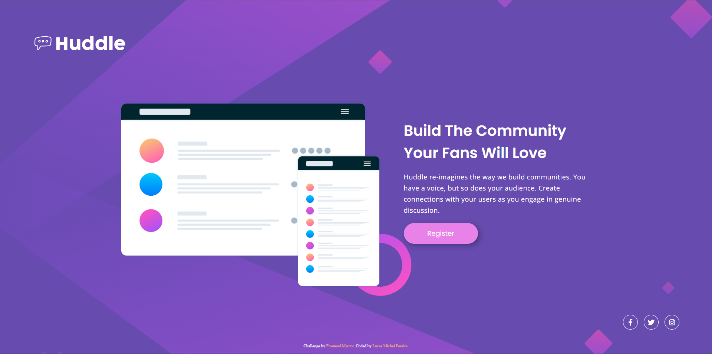

# Frontend Mentor - Huddle landing page with single introductory section solution

This is a solution to the [Huddle landing page with single introductory section challenge on Frontend Mentor](https://www.frontendmentor.io/challenges/huddle-landing-page-with-a-single-introductory-section-B_2Wvxgi0). Frontend Mentor challenges help you improve your coding skills by building realistic projects. 

## Table of contents

- [Overview](#overview)
  - [The challenge](#the-challenge)
  - [Screenshot](#screenshot)
  - [Links](#links)
- [My process](#my-process)
  - [Built with](#built-with)
  - [What I learned](#what-i-learned)
  - [Continued development](#continued-development)
  - [Useful resources](#useful-resources)
- [Author](#author)
- [Acknowledgments](#acknowledgments)

## Overview

### The challenge

Users should be able to:

- View the optimal layout for the page depending on their device's screen size
- See hover states for all interactive elements on the page

### Screenshot



### Links

- Solution URL: [Add solution URL here](https://your-solution-url.com)
- Live Site URL: [Add live site URL here](http://127.0.0.1:5500/)

## My process

### Built with

- Semantic HTML5 markup
- CSS custom properties
- Flexbox
- CSS Grid
- Desktop-first workflow

### What I learned

This is one of the first projects that I've made, so I have learned a lot over the course of it! Some of them were: 

- Better understanding of HTML semantics
- Using grid
- Better class naming
- More specificity in CSS
    ```css
        .hero div button {
            color: var(--violet);
       }
    ```
- Using variables in my project
- Using semiclasses such as :hover
    ```css
        .footer div:hover i {
            color: var(--pink);
        }
    ```
- Understanding rgba
- Box-shadow CSS property
    ```css
        .hero div button {
            box-shadow: rgba(0, 0, 0, .3) 5px 5px 15px;
        }
    ```
- Using fractions as an unit of measurement in CSS
    ```css
        body {
            grid-template-rows: 3fr 9fr 2fr;
        }
    ```

### Continued development

Some areas of this project are still a bit clunky at best so here are some things I'd like to get more comfortable with or refine and perfect:

- HTML button tag
- CSS grid
- Image resizing
- :hover and other semiclasses
- responsiveness in general

### Useful resources

- [StackOverflow](https://stackoverflow.com/) I used this a couple times when I had some questions and there was always someone who made the same question I was making so It was very convinient to find answers.

## Author

- Github - [@lucas-michel-p](https://github.com/lucas-michel-p)
- Frontend Mentor - [@lucas-michel-p](https://www.frontendmentor.io/profile/lucas-michel-p)
- Email - [@lucas michel pereira](lcsmichelpereira@gmail.com)

## Acknowledgments

I made this project with the help of DevEmDobro and their online course DevQuest. They're the reason Im here right now. Thank you.